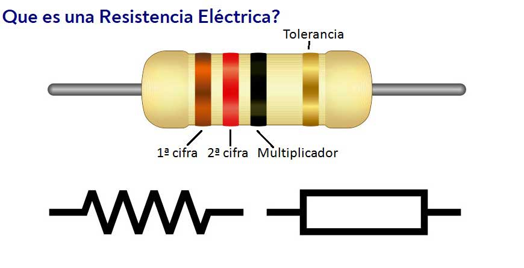
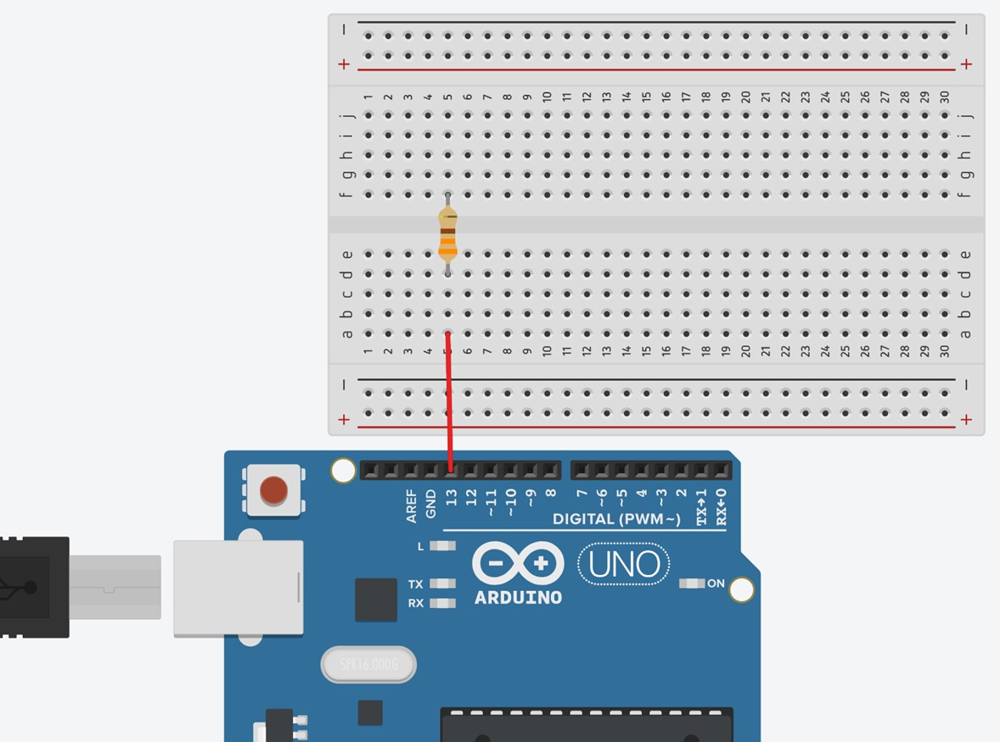

# Hola mundo (Enciende un LED con Arduino)

## Materiales

- 1 Arduino UNO
- 1 Resistencia de 330 ohmios
- 1 LED
- Cables de conexión

## Marco teórico

### Resistencia

Una resistencia es un componente electrónico que se utiliza para limitar la corriente que fluye a través de un circuito. Las resistencias se miden en ohmios (Ω). Para conectar un LED a Arduino, es necesario usar una resistencia para evitar que el LED se queme. Una resistencia de 220 ohmios o superior es adecuada para la mayoría de los LEDs. Las terminales de la resistencia no tienen polaridad.


### LED

Un LED es un diodo emisor de luz. Los LEDs se utilizan para generar luz cuando se aplica una corriente eléctrica. Los LEDs tienen dos terminales: el ánodo y el cátodo. El ánodo es el terminal positivo y el cátodo es el terminal negativo. Para conectar un LED a Arduino, el ánodo debe conectarse al pin de Arduino y el cátodo debe conectarse al pin GND.


### Arduino

Arduino es una plataforma de hardware y software de código abierto para la creación de prototipos electrónicos. Arduino consta de una placa de circuito impreso (PCB) con un microcontrolador, pines de entrada y salida, y un conector USB. El microcontrolador es el cerebro de la placa Arduino. Los pines de entrada y salida se utilizan para conectar sensores, actuadores y otros componentes electrónicos. El conector USB se utiliza para conectar la placa Arduino a un ordenador.


## Conexiones

1. Inserta la resistencia en cualquier posición de tu protoboard. La resistencia ayudará a proteger el LED de daños.

2. El pin de salida número 13 de tu Arduino debe conectarse mediante un cable de conexión a una terminal de tu resistencia. Este pin enviará la corriente eléctrica al LED.

3. La otra terminal de la resistencia debe conectarse a la terminal ánodo (positiva) del LED. Este es el terminal que recibe la corriente eléctrica.

4. El cátodo (negativo) del LED debe conectarse al GND del Arduino mediante un cable de conexión. Este pin sirve como conexión a tierra.


## Programacion

1. Abre el Arduino IDE y crea un nuevo Sketch
2. Conecta tu arduino UNO a tu computadora mediante el cable USB
3. En la pestañas superiores busca la pestaña herramientas, ve a la opcion **Placa**, selecciona **Arduino AVR Boards**, y finalmente selecciona **Arduino Uno. (Herramientas->Placa->Arduino AVR Boards->Arduino Uno)**.

4. DE igual manera en la pestaña de herramientas, ve a la opcion **Puerto** y selecciona el puerto **COM** donde esta conectado. **(Herramientas->Puerto->COM#)**

5. Ingresa el siguiente codigo

    ```arduino

    int led = 13;
    void setup()
    {
    pinMode(led, OUTPUT);
    }

    void loop()
    {
    digitalWrite(led, HIGH);
    }
    ```

6. Una vez escrito el codigo hay que verificarlo en el boton **Verficar** para comprobar que no haya errores de sintaxis


7. Una vez verificado, haremos click en el boton de cargar


8. Comprobar que en tu placa Arduino encienda el LED
