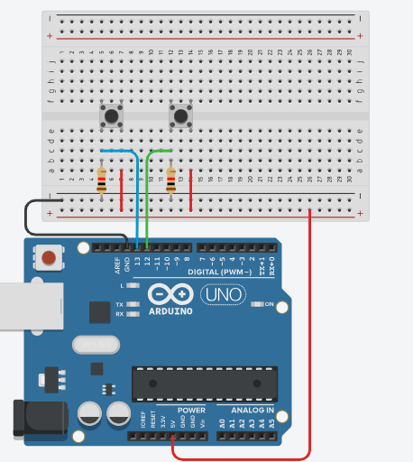

# Solucion de Contador de personas (Actividad)

Un edificio tiene dos puertas, una para entrar y otra para salir. Se necesita un sistema para contar el número de personas que entran y salen del edificio cada día.

## Restricciones

- El sistema debe ser capaz de contar el número de personas que entran y salen del edificio de forma precisa.
- El sistema debe ser capaz de almacenar los datos de forma segura.
- El sistema debe ser fácil de usar y mantener.
- Se debe visualizar en el monitor Serial el numero de personas que hayan entrado, salido, cuantas estan en el interior
- No deben haber contadores negativos
- Debe ser logico, es decir, *No deben a salir personas si no han entrado todavia

## Materiales

- 2 pulsadores
- 2 resistencia de 1K ohms
- Arduino Uno
- Cables de conexion

## Conexiones



## Codigo

```arduino
#define pulsadorEntrada 13
#define pulsadorSalida 12

int contadorEntrada = 0;
int contadorSalida = 0;
int contadorInterior = 0;

void setup()
{
  Serial.begin(9600);
  pinMode(pulsadorEntrada, INPUT);
  pinMode(pulsadorSalida, INPUT);
}

void loop()
{
  if(digitalRead(pulsadorEntrada) == HIGH) contadorEntrada++;
  if(digitalRead(pulsadorSalida) == HIGH && contadorEntrada > contadorSalida) contadorSalida++;
  contadorInterior = contadorEntrada - contadorSalida;

  Serial.println("Personas que han entrado: "+ String(contadorEntrada));
  Serial.println("Personas que han salido: "+ String(contadorSalida));
  Serial.println("Personas en el interior: "+ String(contadorInterior));

  delay(1000);
}
```
