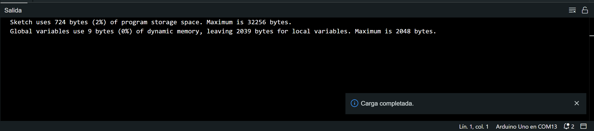

# Encender LED con un pulsador

## Materiales

- 1 Arduino UNO
- 1 Resistencia de 330 ohmios
- 1 Resistencia de 1k ohmios
- 1 LED
- 1 Pulsador
- Cables de conexión

## Marco teórico

### Resistencia

Una resistencia es un componente electrónico que se utiliza para limitar la corriente que fluye a través de un circuito. Las resistencias se miden en ohmios (Ω). Para conectar un LED a Arduino, es necesario usar una resistencia para evitar que el LED se queme. Una resistencia de 220 ohmios o superior es adecuada para la mayoría de los LEDs. **Las terminales de la resistencia no tienen polaridad.**


### LED

Un LED es un diodo emisor de luz. Los LEDs se utilizan para generar luz cuando se aplica una corriente eléctrica. Los LEDs tienen dos terminales: el ánodo y el cátodo. El ánodo es el terminal positivo y el cátodo es el terminal negativo. Para conectar un LED a Arduino, el ánodo debe conectarse al pin de Arduino y el cátodo debe conectarse al pin GND. **La patita mas larga del LED es el postivo y la mas corta el negativo.**


### Arduino

Arduino es una plataforma de hardware y software de código abierto para la creación de prototipos electrónicos. Arduino consta de una placa de circuito impreso (PCB) con un microcontrolador, pines de entrada y salida, y un conector USB. El microcontrolador es el cerebro de la placa Arduino. Los pines de entrada y salida se utilizan para conectar sensores, actuadores y otros componentes electrónicos. El conector USB se utiliza para conectar la placa Arduino a un ordenador.


## Conexiones

1. Inserta la resistencia de 330 ohms en cualquier posición de tu protoboard. La resistencia ayudará a proteger el LED de daños.
    > **Las terminales de la resistencia no tienen polaridad.**

    

2. El pin de salida número 13 de tu Arduino debe conectarse mediante un cable de conexión a una terminal de tu resistencia de 330 ohms. Este pin enviará la corriente eléctrica al LED.

    > **La patita mas larga del LED es el postivo y la mas corta el negativo.**

    

3. La otra terminal de la resistencia de 330 ohms debe conectarse a la terminal ánodo (positiva) del LED. Este es el terminal que recibe la corriente eléctrica.
    
4. Una salida de **GND** del arduino se debera conectar en la linea de negativo de la protoboard. Y la terminal negativa del LED debera conectarse a la linea negativa del protoboard

    
5. Coloca el pulsador en cualquier posicion de tu protoboard. Este pulsador nos ayudara a encender o apagar el  led

    

6. Coloca tu resistencia de 1k ohms entre un terminal de tu pulsador y el negativo de tu protoboard

    

7. Una salida de **5V** del arduino se debera conectar en la linea de positiva de la protoboard

    
8. Conecta la otra terminal de tu pulsador a la linea positiva de la protoboard

    

9. El pin de salida numero 12 de tu arduino debe conectarse mediante un cable de conexion a tarminal entre la resistencia de 1k ohms y la terminal del pulsador. **Como se muestra en la imagen**

    

> Nota: En las imagenes hubo error desde el paso 4 ya que no se conecto la terminal negativa del LED al negativo de la protoboard. Este paso se debe hacer para que se pueda ver el LED encenderse con el pulsador

## Programacion

1. Abre el Arduino IDE y crea un nuevo Sketch.
2. Conecta tu Arduino UNO a tu computadora mediante el cable USB.
3. En la pestaña superior, ve a **Herramientas**, selecciona **Placa**, selecciona **Arduino AVR Borads**y elige **Arduino Uno (Herramientas->Placa->Arduino AVR Boards->Arduino Uno)**.

4. Del mismo modo, en la pestaña de herramientas, selecciona el puerto **COM** al que está conectado tu Arduino **(Herramientas->Puerto->COM#)** *Donde "#" puede ser cualquier numero*.

5. Ingresa el siguiente código Arduino en el editor:

    ```arduino
    int pulsador = 12;
    int led = 13;
    int val = 0;
    void setup()
    {
        pinMode(led, OUTPUT);
        pinMode(pulsador, INPUT);
    }

    void loop()
    {
        val = digitalRead(pulsador);
        digitalWrite(led,val);
    }
    ```

    o tambien el siguiente codigo

    ```arduino
    int pulsador = 12;
    int led = 13;
    void setup()
    {
    pinMode(led, OUTPUT);
    pinMode(pulsador, INPUT);
    }

    void loop()
    {
    if(digitalRead(pulsador) == HIGH){
        digitalWrite(led,HIGH);
    }else{
        digitalWrite(led,LOW);
        }
    }
    ```

6. Una vez escrito el código, verifica que no haya errores de sintaxis haciendo clic en el botón **Verificar**.


7. Cuando el código se verifique sin errores, carga el programa en tu Arduino haciendo clic en el botón de carga.



8. Comprueba que el LED de tu placa Arduino se encienda.
