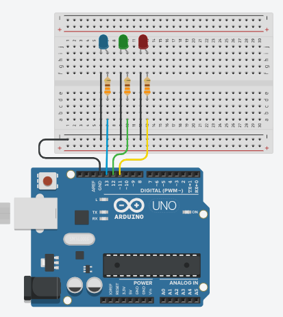

# FIZZBUZZ (Actividad)

"Fizz Buzz" es un juego o ejercicio comúnmente utilizado en la programación para enseñar conceptos básicos de control de flujo y lógica a los principiantes. El objetivo es imprimir una serie de números y aplicar ciertas reglas a esos números mientras los imprimes. Las reglas son las siguientes:

- Para cada número del 1 al n (donde n es un número determinado):
- Si el número es divisible por 3, imprime "Fizz" en lugar del número.
- Si el número es divisible por 5, imprime "Buzz" en lugar del número.
- Si el número es divisible tanto por 3 como por 5, imprime "FizzBuzz".
- Si el número no cumple con ninguna de las reglas anteriores, imprime el número tal como es.

En esta ocasion utilizaremos el monitor Serie para darle valor a n y visualizaremos los valores tanto en unos LEDS como en el monitor Serie

## Restriccionnes

- Encender el LED Azul Si el número es divisible por 3, imprime "Fizz" en el monitor serie.
- Encender el LED Verde Si el número es divisible por 5, imprime "Buzz" en el monitor serie.
- Encender el LED Azul y Verde Si el número es divisible tanto por 3 como por 5, imprime "FizzBuzz" en el monitor serie.
- Encender el LED Rojo  Si el número no cumple con ninguna de las reglas anteriores, imprime el número tal como es en el monitor serie.

## Materiales

- 1 LED Rojos
- 1 LED Verdes
- 1 LED Azul
- 3 resistencias superiores a 220 ohms
- Arduino UNO
- Cables de conexion

## Conexiones



## Codigo

```arduino
#define ledFizz 13
#define ledBuzz 12
#define ledNot 11

int numero;

void setup()
{
  Serial.begin(9600);
  pinMode(ledFizz, OUTPUT);
  pinMode(ledBuzz, OUTPUT);
  pinMode(ledNot, OUTPUT);
}

void loop()
{
  Serial.println("Ingrese un numero positivo");
  delay(5000);
  if(Serial.available()){
    numero = Serial.readString().toInt();
    for(int i = 1; i <= numero; i++){
      if(i % 3 == 0 && i % 5 == 0){
        Serial.println("FIZZBUZZ");
        digitalWrite(ledFizz, HIGH);
        digitalWrite(ledBuzz, HIGH);
      }else if(i % 3 == 0){
        Serial.println("FIZZ");
        digitalWrite(ledFizz, HIGH);
      }else if(i % 5 == 0){
        Serial.println("BUZZ");
        digitalWrite(ledBuzz, HIGH);
      }else{
        Serial.println(i);
        digitalWrite(ledNot,HIGH);
      }

      delay(1000);
      digitalWrite(ledBuzz,LOW);
      digitalWrite(ledFizz,LOW);
      digitalWrite(ledNot,LOW);
    }
  }
  delay(5000);
}
```
