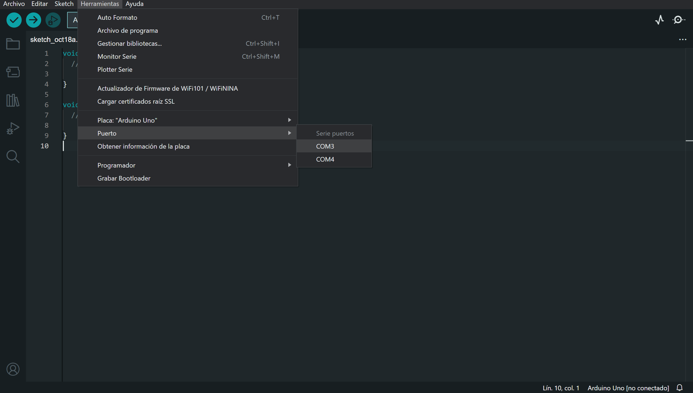
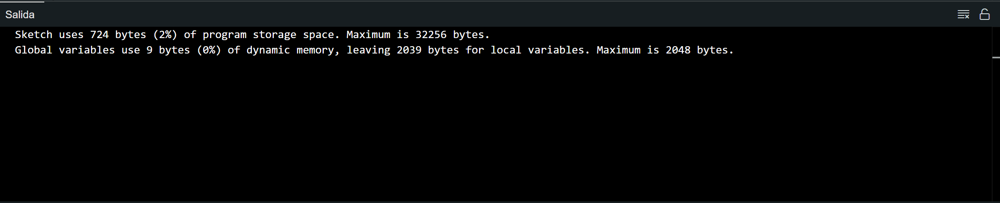

# Hola mundo (Enciende un LED con Arduino)

## Materiales

- 1 Arduino UNO
- 1 Resistencia de 330 ohmios
- 1 LED
- Cables de conexión

## Marco teórico

### Resistencia

Una resistencia es un componente electrónico que se utiliza para limitar la corriente que fluye a través de un circuito. Las resistencias se miden en ohmios (Ω). Para conectar un LED a Arduino, es necesario usar una resistencia para evitar que el LED se queme. Una resistencia de 220 ohmios o superior es adecuada para la mayoría de los LEDs. **Las terminales de la resistencia no tienen polaridad.**


### LED

Un LED es un diodo emisor de luz. Los LEDs se utilizan para generar luz cuando se aplica una corriente eléctrica. Los LEDs tienen dos terminales: el ánodo y el cátodo. El ánodo es el terminal positivo y el cátodo es el terminal negativo. Para conectar un LED a Arduino, el ánodo debe conectarse al pin de Arduino y el cátodo debe conectarse al pin GND. **La patita mas larga del LED es el postivo y la mas corta el negativo.**


### Arduino

Arduino es una plataforma de hardware y software de código abierto para la creación de prototipos electrónicos. Arduino consta de una placa de circuito impreso (PCB) con un microcontrolador, pines de entrada y salida, y un conector USB. El microcontrolador es el cerebro de la placa Arduino. Los pines de entrada y salida se utilizan para conectar sensores, actuadores y otros componentes electrónicos. El conector USB se utiliza para conectar la placa Arduino a un ordenador.


## Conexiones

1. Inserta la resistencia en cualquier posición de tu protoboard. La resistencia ayudará a proteger el LED de daños.
    > **Las terminales de la resistencia no tienen polaridad.**

    

2. El pin de salida número 13 de tu Arduino debe conectarse mediante un cable de conexión a una terminal de tu resistencia. Este pin enviará la corriente eléctrica al LED.

    > **La patita mas larga del LED es el postivo y la mas corta el negativo.**

    

3. La otra terminal de la resistencia debe conectarse a la terminal ánodo (positiva) del LED. Este es el terminal que recibe la corriente eléctrica.
    
4. El cátodo (negativo) del LED debe conectarse al GND del Arduino mediante un cable de conexión. Este pin sirve como conexión a tierra.
    

## Programacion

1. Abre el Arduino IDE y crea un nuevo Sketch.
2. Conecta tu Arduino UNO a tu computadora mediante el cable USB.
3. En la pestaña superior, ve a **Herramientas**, selecciona **Placa**, selecciona **Arduino AVR Borads**y elige **Arduino Uno (Herramientas->Placa->Arduino AVR Boards->Arduino Uno)**.

4. Del mismo modo, en la pestaña de herramientas, selecciona el puerto **COM** al que está conectado tu Arduino **(Herramientas->Puerto->COM#)** *Donde "#" puede ser cualquier numero*.

5. Ingresa el siguiente código Arduino en el editor:

    ```arduino
    int led = 13;
    void setup()
    {
    pinMode(led, OUTPUT);
    }

    void loop()
    {
    digitalWrite(led, HIGH);
    }
    ```

6. Una vez escrito el código, verifica que no haya errores de sintaxis haciendo clic en el botón **Verificar**.



7. Cuando el código se verifique sin errores, carga el programa en tu Arduino haciendo clic en el botón de carga.


8. Comprueba que el LED de tu placa Arduino se encienda.

## Explicacion

### Definicion del pin

Esta línea declara una variable llamada led y le asigna el valor 13. Esto se utiliza para almacenar el número del pin al que está conectado el LED que queremos controlar.

```arduino
int led = 13;
```

Otra manera de definir los pines de entrada o salida es de la siguiente manera

```arduino
#define led  13
```

### void setup(){}

Esta es una función especial en Arduino que se llama una vez al inicio del programa. Se utiliza para realizar configuraciones iniciales.

### void loop(){}

 Esta es otra función especial en Arduino que se ejecuta continuamente en un ciclo. Aquí es donde colocas las instrucciones que deseas que el Arduino repita una y otra vez.

### pinMode()

```arduino
pinMode(led, OUTPUT);
```

Esta línea configura el pin especificado por la variable led (que es el pin 13 en este caso) como una salida digital. Esto significa que el pin 13 se utilizará para enviar señales de encendido y apagado (HIGH y LOW).

**pinMode()**: Configura el pin especificado para que se comporte como entrada o salida

#### Sintaxis

```arduino
pinMode(pin, mode)
```

#### Parametros

- pin: el número de pin de Arduino para configurar el modo.
- mode: INPUT(*Entrada*), OUTPUT(*Salida*).

### digitalWrite()

```arduino
digitalWrite(led, HIGH);
```

Esta línea establece el pin especificado por led en un estado "alto" (HIGH), lo que significa que se aplica un voltaje positivo al pin.

**digitalWrite**: Si el pin se ha configurado como OUTPUTcon pinMode(), su voltaje se establecerá en el valor correspondiente: 5 V (o 3,3 V en placas de 3,3 V) para HIGH, 0 V (tierra) para LOW.

#### Sintaxis

```arduino
digitalWrite(led, HIGH);
```

#### Parametros

- pin: el número de pin de Arduino.
- value: *HIGH* o *LOW*.
