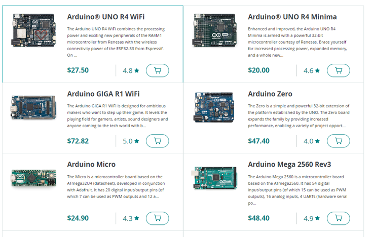
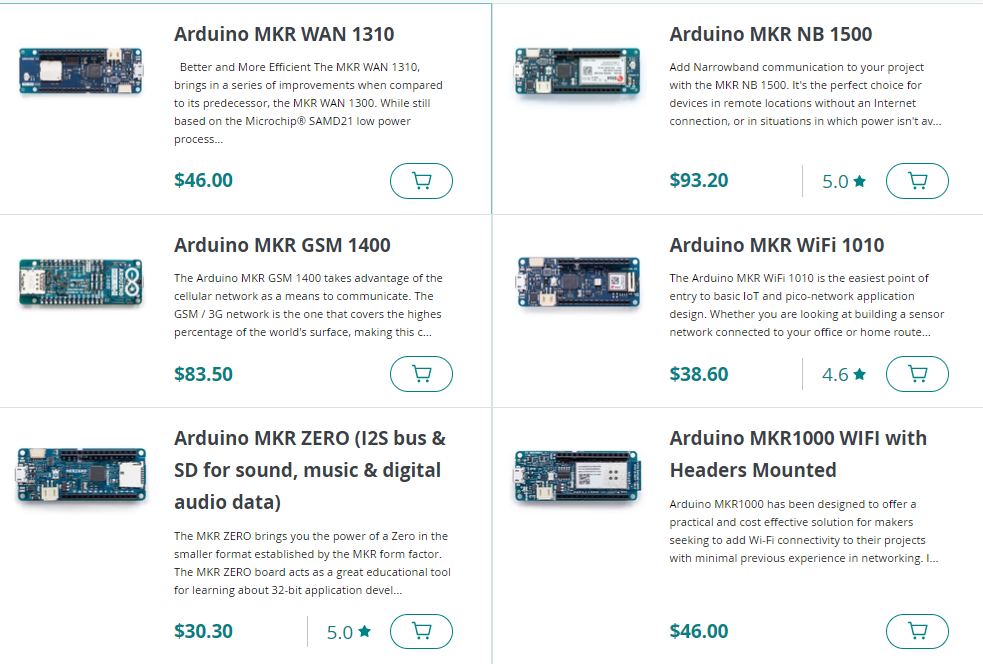
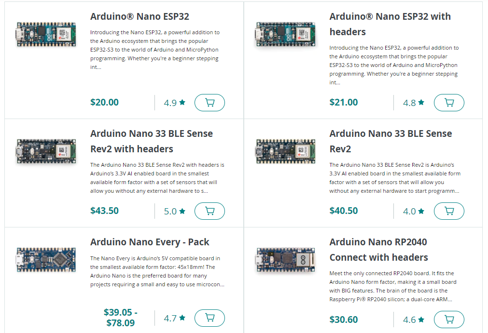
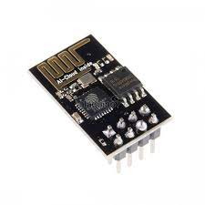
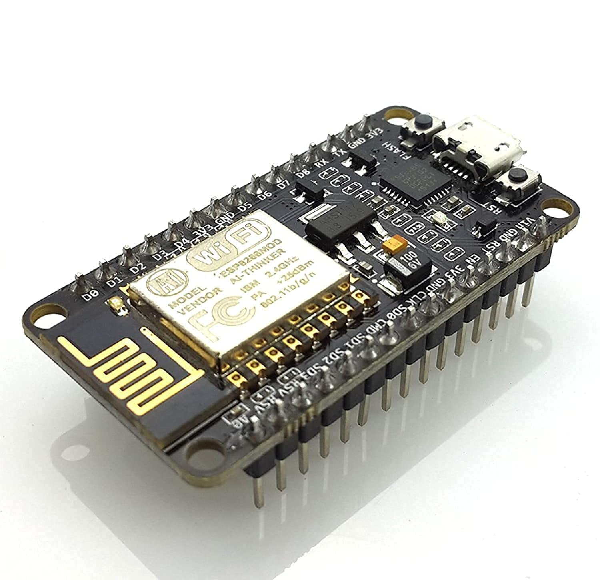
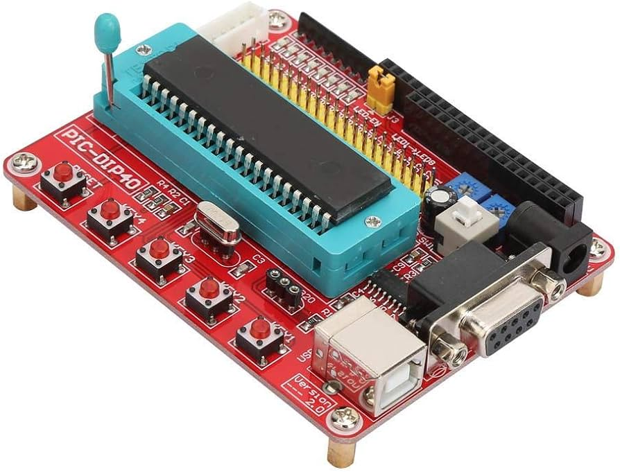

# Introduccion a la sesion 01

## ¿Qué es Arduino?

Arduino es una plataforma de hardware y software libre, basada en un microcontrolador, diseñada para facilitar el uso de la electrónica en proyectos multidisciplinares. Arduino es una tecnología con el uso de directo de hardware y software.

## ¿Para qué sirve Arduino?

Arduino se puede utilizar para una amplia gama de proyectos, desde simples proyectos de bricolaje hasta aplicaciones industriales. Algunos ejemplos de proyectos que se pueden realizar con Arduino incluyen:

- **Electrónica recreativa**: Arduino se puede utilizar para crear juguetes, juegos y otras aplicaciones de entretenimiento.
- **Automatización**: Arduino se puede utilizar para controlar dispositivos y procesos de forma automática.
- **Sensores**: Arduino se puede utilizar para recopilar datos de sensores y controlar dispositivos basados en esos datos.
- **Internet de las cosas (IoT)**: Arduino se puede utilizar para crear dispositivos conectados a Internet.

## Placas de desarrollo Arduino

Las placas de la familia Arduino se pueden dividir en 3 tipos de familias:

### Core

El tipo Core es el tipo más común de placa Arduino. Estas placas utilizan microcontroladores ATmega de 8 bits. Son una buena opción para proyectos básicos y de nivel intermedio.

Las placas Core son una buena opción para proyectos básicos y de nivel intermedio. Son fáciles de usar y tienen una amplia gama de recursos disponibles.

#### Algunos ejemplos de placas Core incluyen

- Arduino UNO
- Arduino MEGA
- Arduino Leonardo
- Arduino Due
- Arduino Uno R4 WiFi 😍

#### Algunos ejemplos de proyectos que se pueden realizar con placas Core incluyen

- Control de dispositivos
- Sensores
- Automatización
- Electrónica recreativa

### Mkr

El tipo Mkr es un tipo más nuevo de placa Arduino. Estas placas utilizan microcontroladores ARM de 32 bits. Son una buena opción para proyectos que requieren un mayor rendimiento o funcionalidad.

Las placas Mkr son una buena opción para proyectos que requieren un mayor rendimiento o funcionalidad. Son más potentes que las placas Core y tienen características adicionales, como conectividad WiFi y Bluetooth.

#### Algunos ejemplos de placas Mkr incluyen

- Arduino MKR1000
- Arduino MKRZero
- Arduino MKR1010
- Arduino MKR1000 WiFi

#### Algunos ejemplos de proyectos que se pueden realizar con placas Mkr incluyen

- Proyectos IoT
- Proyectos de inteligencia artificial
- Proyectos de visión artificial
- Proyectos de robótica

### Nano

El tipo Nano es un tipo de placa Arduino de tamaño pequeño. Estas placas son una buena opción para proyectos compactos o para aplicaciones de wearables.

Las placas Nano son una buena opción para proyectos compactos o para aplicaciones de wearables. Son pequeñas y ligeras, lo que las hace ideales para proyectos que deben caber en espacios reducidos.

#### Algunos ejemplos de placas Nano incluyen

- Arduino Nano
- Arduino Nano Every
- Arduino Nano 33 BLE
- Arduino Nano ESP32 😍

#### Algunos ejemplos de proyectos que se pueden realizar con placas Nano incluyen

- Proyectos de wearables
- Proyectos de Internet de las cosas
- Proyectos de automatización
- Proyectos de electrónica recreativa

## Placas de desarrollo independientes de la familia Arduino

### ESP8266

La placa ESP8266 es una placa WiFi que se puede utilizar para conectar Arduino a Internet. Es una buena opción para proyectos IoT, como sensores remotos y dispositivos controlados por aplicaciones.

Características principales

- Microcontrolador ESP8266EX de 32 bits
- Conectividad WiFi
- Puertos GPIO
- Puerto UART
- Puerto SPI

Usos comunes

- Sensores remotos
- Dispositivos controlados por aplicaciones
- Automatización
- IoT

### ESP32

La placa ESP32 es una placa WiFi y Bluetooth que se puede utilizar para conectar Arduino a Internet y a otros dispositivos. Es una buena opción para proyectos que requieren una mayor potencia o funcionalidad, como robótica y visión artificial.

Características principales:

- Microcontrolador ESP32 de 32 bits
- Conectividad WiFi y Bluetooth
- Puertos GPIO
- Puerto UART
- Puerto SPI
- Puerto I2C

Usos comunes:

- Robótica
- Visión artificial
- IoT
- Inteligencia artificial

### Raspberry Pi

La Raspberry Pi es una computadora de placa única que se puede utilizar con Arduino para crear proyectos más avanzados. Es una buena opción para proyectos que requieren un mayor rendimiento o funcionalidad, como visión artificial y aprendizaje automático.

Características principales:

- Procesador de cuatro núcleos
- Memoria RAM de 1 GB o 2 GB
- Puertos USB
- Puerto Ethernet
- Puerto HDMI

Usos comunes:

- Visión artificial
- Aprendizaje automático
- Robótica
- IoT

### PIC

Las placas PIC son una familia de microcontroladores de 8 bits que se utilizan en una amplia gama de aplicaciones. Son una buena opción para proyectos que requieren un bajo consumo de energía o un tamaño compacto.

Características principales:

- Microcontrolador PIC de 8 bits
- Puertos GPIO
- Puerto UART
- Puerto SPI
- Puerto I2C

Usos comunes:

- Control de dispositivos
- Sensores
- Automatización
- Electrónica recreativa

## Arduino UNO R3
