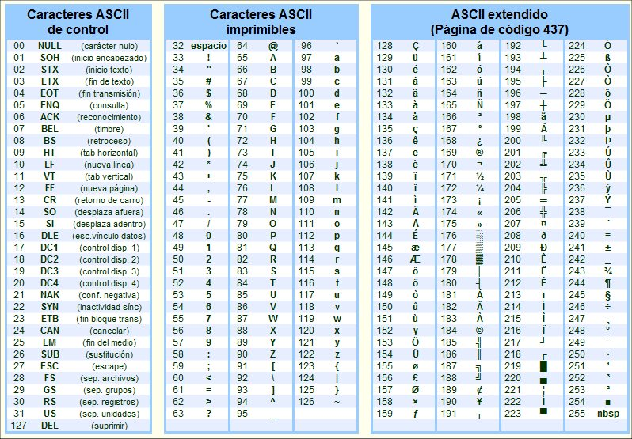

# Introduccion a la sesion 01

## Índice

1. [Introducción a la Sesión 01](#introduccion-a-la-sesion-01)
2. [¿Qué es Arduino?](#qué-es-arduino)
3. [¿Para qué sirve Arduino?](#para-qué-sirve-arduino)
4. [Placas de Desarrollo Arduino](#placas-de-desarrollo-arduino)
   - [Placas Core](#core)
   - [Placas Mkr](#mkr)
   - [Placas Nano](#nano)
5. [Placas de Desarrollo Independientes de la Familia Arduino](#placas-de-desarrollo-independientes-de-la-familia-arduino)
   - [ESP8266](#esp8266)
   - [ESP32](#esp32)
   - [Raspberry Pi](#raspberry-pi)
   - [PIC](#pic)
6. [Arduino UNO R3](#arduino-uno-r3)
   - [Pines (Pin Out)](#pines-pin-out)
        - [Pines de Alimentación](#pines-de-alimentacion)
        - [Pines Analógicos](#pines-analogicos)
        - [Pines Digitales](#pines-digitales)
            - [PWM](#pwm)
        - [Comunicación](#comunicacion)
            - [Comunicación I2C](#comunicación-i2c)
            - [Comunicación SPI](#comunicación-spi)
            - [Comunicación UART](#comunicación-uart)
7. [Arduino IDE](#arduino-ide)
8. [Programacion en Arduino IDE](#programacion-en-arduino-ide)
   - [Estructura de programas](#estructura-de-los-programas-en-arduino-ide)
9. [Tipos de datos](#tipos-de-datos)
   - [byte](#byte)
   - [char](#char)
   - [float](#float)
   - [double](#double)
   - [int](#int)
   - [long](#long)
   - [string primitivo](#string-sin-objecto)
   - [String()](#string)
   - [array](#array)
10. [Funciones y definiciones](#funciones-y-definiciones)
      - [Definicion de pines](#definiciones-del-pin)
      - [pinMode()](#pinmode)
      - [digitalWrite()](#digitalwrite)
      - [delay](#delay)

## ¿Qué es Arduino?

Arduino es una plataforma de hardware y software libre, basada en un microcontrolador, diseñada para facilitar el uso de la electrónica en proyectos multidisciplinares. Arduino es una tecnología con el uso de directo de hardware y software.

## ¿Para qué sirve Arduino?

Arduino se puede utilizar para una amplia gama de proyectos, desde simples proyectos de bricolaje hasta aplicaciones industriales. Algunos ejemplos de proyectos que se pueden realizar con Arduino incluyen:

- **Electrónica recreativa**: Arduino se puede utilizar para crear juguetes, juegos y otras aplicaciones de entretenimiento.
- **Automatización**: Arduino se puede utilizar para controlar dispositivos y procesos de forma automática.
- **Sensores**: Arduino se puede utilizar para recopilar datos de sensores y controlar dispositivos basados en esos datos.
- **Internet de las cosas (IoT)**: Arduino se puede utilizar para crear dispositivos conectados a Internet.

## Placas de desarrollo Arduino

Las placas de la familia Arduino se pueden dividir en 3 tipos de familias:

### Core

El tipo Core es el tipo más común de placa Arduino. Estas placas utilizan microcontroladores ATmega de 8 bits. Son una buena opción para proyectos básicos y de nivel intermedio.

Las placas Core son una buena opción para proyectos básicos y de nivel intermedio. Son fáciles de usar y tienen una amplia gama de recursos disponibles.

#### Algunos ejemplos de placas Core incluyen

- Arduino UNO
- Arduino MEGA
- Arduino Leonardo
- Arduino Due
- Arduino Uno R4 WiFi 😍


#### Algunos ejemplos de proyectos que se pueden realizar con placas Core incluyen

- Control de dispositivos
- Sensores
- Automatización
- Electrónica recreativa

### Mkr

El tipo Mkr es un tipo más nuevo de placa Arduino. Estas placas utilizan microcontroladores ARM de 32 bits. Son una buena opción para proyectos que requieren un mayor rendimiento o funcionalidad.

Las placas Mkr son una buena opción para proyectos que requieren un mayor rendimiento o funcionalidad. Son más potentes que las placas Core y tienen características adicionales, como conectividad WiFi y Bluetooth.

#### Algunos ejemplos de placas Mkr incluyen

- Arduino MKR1000
- Arduino MKRZero
- Arduino MKR1010
- Arduino MKR1000 WiFi


#### Algunos ejemplos de proyectos que se pueden realizar con placas Mkr incluyen

- Proyectos IoT
- Proyectos de inteligencia artificial
- Proyectos de visión artificial
- Proyectos de robótica

### Nano

El tipo Nano es un tipo de placa Arduino de tamaño pequeño. Estas placas son una buena opción para proyectos compactos o para aplicaciones de wearables.

Las placas Nano son una buena opción para proyectos compactos o para aplicaciones de wearables. Son pequeñas y ligeras, lo que las hace ideales para proyectos que deben caber en espacios reducidos.

#### Algunos ejemplos de placas Nano incluyen

- Arduino Nano
- Arduino Nano Every
- Arduino Nano 33 BLE
- Arduino Nano ESP32 😍


#### Algunos ejemplos de proyectos que se pueden realizar con placas Nano incluyen

- Proyectos de wearables
- Proyectos de Internet de las cosas
- Proyectos de automatización
- Proyectos de electrónica recreativa

## Placas de desarrollo independientes de la familia Arduino

### ESP8266

La placa ESP8266 es una placa WiFi que se puede utilizar para conectar Arduino a Internet. Es una buena opción para proyectos IoT, como sensores remotos y dispositivos controlados por aplicaciones.


Características principales

- Microcontrolador ESP8266EX de 32 bits
- Conectividad WiFi
- Puertos GPIO
- Puerto UART
- Puerto SPI

Usos comunes

- Sensores remotos
- Dispositivos controlados por aplicaciones
- Automatización
- IoT

### ESP32

La placa ESP32 es una placa WiFi y Bluetooth que se puede utilizar para conectar Arduino a Internet y a otros dispositivos. Es una buena opción para proyectos que requieren una mayor potencia o funcionalidad, como robótica y visión artificial.


Características principales:

- Microcontrolador ESP32 de 32 bits
- Conectividad WiFi y Bluetooth
- Puertos GPIO
- Puerto UART
- Puerto SPI
- Puerto I2C

Usos comunes:

- Robótica
- Visión artificial
- IoT
- Inteligencia artificial

### Raspberry Pi

La Raspberry Pi es una computadora de placa única que se puede utilizar con Arduino para crear proyectos más avanzados. Es una buena opción para proyectos que requieren un mayor rendimiento o funcionalidad, como visión artificial y aprendizaje automático.


Características principales:

- Procesador de cuatro núcleos
- Memoria RAM de 1 GB o 2 GB
- Puertos USB
- Puerto Ethernet
- Puerto HDMI

Usos comunes:

- Visión artificial
- Aprendizaje automático
- Robótica
- IoT

### PIC

Las placas PIC son una familia de microcontroladores de 8 bits que se utilizan en una amplia gama de aplicaciones. Son una buena opción para proyectos que requieren un bajo consumo de energía o un tamaño compacto.


Características principales:

- Microcontrolador PIC de 8 bits
- Puertos GPIO
- Puerto UART
- Puerto SPI
- Puerto I2C

Usos comunes:

- Control de dispositivos
- Sensores
- Automatización
- Electrónica recreativa

## Arduino UNO R3

El Arduino Uno es una placa de microcontrolador de código abierto basado en el microchip ATmega328P y desarrollado por Arduino.cc.1​2​ La placa está equipada con conjuntos de pines de E/S digitales y analógicas que pueden conectarse a varias placas de expansión y otros circuitos. La placa tiene 14 pines digitales, 6 pines analógicos y programables con el Arduino IDE (Entorno de desarrollo integrado) a través de un cable USB tipo B.3​ Puede ser alimentado por el cable USB o por una batería externa


### Pines (Pin Out)

#### Pines de alimentacion

Los pines de alimentación de Arduino UNO R3 proporcionan energía a la placa y a los componentes conectado a ella

- **Vin**: Este pin se puede utilizar para alimentar la placa desde una fuente externa de 7 a 20 voltios.
- **5V**: Este pin proporciona una salida de 5 voltios a la placa.
- **3.3V**: Este pin proporciona una salida de 3.3 voltios a la placa.
- **GND**: Este pin es la conexión a tierra de la placa.

#### Pines analogicos

Los pines analógicos de Arduino UNO R3 se pueden utilizar para leer datos de sensores analógicos. Cada pin analógico proporciona 10 bits de resolución, lo que significa que puede leer 1024 valores diferentes.

A0-A5: Estos pines proporcionan una entrada analógica de 0 a 5 voltios.

#### Pines digitales

Los pines digitales de Arduino UNO R3 se pueden utilizar para controlar dispositivos digitales, como luces LED y motores. Cada pin digital puede funcionar como entrada o salida. **0-13: Estos pines pueden funcionar como entrada o salida.**

- **Entrada**: Los pines digitales de entrada se pueden utilizar para leer datos de sensores.
- **Salida**: Los pines digitales de salida se pueden utilizar para controlar dispositivos.

##### PWM

PWM significa "modulación de ancho de pulso". Es una técnica que se utiliza para controlar la salida de un dispositivo digital. Con PWM, se puede variar el ancho de un pulso para controlar la potencia o el brillo de un dispositivo.

> En Arduino, los pines 3, 5, 6, 9, 10 y 11 pueden utilizarse para PWM.

#### Comunicacion

Los puertos de comunicación de Arduino UNO R3 se pueden utilizar para conectar Arduino a otros dispositivos.

- **USB**: El puerto USB se utiliza para conectar Arduino a una computadora.
- **UART**: El puerto UART se utiliza para la comunicación serie.
- **SPI**: El puerto SPI se utiliza para la comunicación en serie de alta velocidad.
- **I2C**: El puerto I2C se utiliza para la comunicación en serie de baja velocidad.

##### Comunicación I2C

I2C es un protocolo de comunicación serie de baja velocidad que se utiliza para conectar dispositivos electrónicos. Arduino UNO R3 tiene dos pines I2C:

- SDA: Este pin se utiliza para la transmisión de datos.
- SCL: Este pin se utiliza para la sincronización de la transmisión de datos.

##### Comunicación SPI

SPI es un protocolo de comunicación serie de alta velocidad que se utiliza para conectar dispositivos electrónicos. Arduino UNO R3 tiene cuatro pines SPI:

- MISO: Este pin se utiliza para la recepción de datos.
- MOSI: Este pin se utiliza para la transmisión de datos.
- SCK: Este pin se utiliza para la sincronización de la transmisión de datos.
- SS: Este pin se utiliza para seleccionar el dispositivo de destino.

##### Comunicación UART

UART es un protocolo de comunicación serie que se utiliza para conectar dispositivos electrónicos. Arduino UNO R3 tiene dos pines UART:

- TX: Este pin se utiliza para la transmisión de datos.
- RX: Este pin se utiliza para la recepción de datos.

## Arduino IDE

Arduino IDE es un entorno de desarrollo integrado (IDE) que se utiliza para programar placas Arduino. Es un software gratuito y de código abierto que está disponible para Windows, macOS y Linux.
Arduino IDE incluye un editor de código, un compilador y un depurador. El editor de código se utiliza para escribir el código del programa. El compilador se utiliza para convertir el código en código máquina que puede ser ejecutado por la placa Arduino. El depurador se utiliza para encontrar y corregir errores en el código.

Arduino IDE es una herramienta poderosa que permite a los usuarios crear una amplia gama de proyectos electrónicos. Es una buena opción para principiantes y usuarios avanzados.

- Editor de código: El editor de código de Arduino IDE es un editor de texto básico con algunas funciones avanzadas, como resaltado de sintaxis y autocompletado.
- Compilador: El compilador de Arduino IDE es un compilador de C++ que se utiliza para convertir el código del programa en código máquina que puede ser ejecutado por la - - placa Arduino.
- Depuración: El depurador de Arduino IDE permite a los usuarios encontrar y corregir errores en el código.
- Librerías: Arduino IDE incluye una biblioteca de funciones y clases que se pueden utilizar para crear proyectos electrónicos.

## Programacion en Arduino IDE

- Es secuencial: El código de Arduino se ejecuta de forma secuencial, es decir, un bloque de código se ejecuta a la vez, seguido del siguiente bloque de código.
- Deriva de C++: El código de Arduino se basa en el lenguaje de programación C++. Sin embargo, Arduino IDE incluye una serie de bibliotecas y funciones que simplifican la programación para principiantes.

### Estructura de los programas en arduino IDE

Un programa de Arduino se denomina sketch o proyecto y tiene la extensión .ino. Importante: para que funcione el sketch, el nombre del fichero debe estar en un directorio con el mismo nombre que el sketch.

La estructura básica de un sketch de Arduino es bastante simple y se compone de al menos dos partes. Estas dos partes son obligatorios y encierran bloques que contienen declaraciones, estamentos o instrucciones.

- **setup()**: La setup()función se llama cuando comienza un boceto. Úselo para inicializar variables, modos de pin, comenzar a usar bibliotecas, etc. La setup()función solo se ejecutará una vez, después de cada encendido o reinicio de la placa Arduino.
- **loop()**: Después de crear una setup()función, que inicializa y establece los valores iniciales, la loop()función hace precisamente lo que sugiere su nombre y realiza un bucle consecutivo, permitiendo que su programa cambie y responda. Úselo para controlar activamente la placa Arduino.

```arduino

// Importamos la biblioteca o librerias que vayamos a ocupar
#include <Servo.h>

// Realizamos declaraciones de pines

#define pinServo 9

// Instancias de objetos
Servo servo;

// Variables
int grados;

// Inicialización
void setup() {
  // Configuramos el pinServo como salida
  pinMode(pinServo, OUTPUT);

  // Inicializamos el servomotor
  servo.attach(pinServo);
}

// Bucle principal
void loop() {
  // Movemos el servomotor de 0 a 180 grados
  for (int i = 0; i <= 180; i++) {
    servo.write(i);
    delay(10);
  }

  // Movemos el servomotor de 180 a 0 grados
  for (int i = 180; i >= 0; i--) {
    servo.write(i);
    delay(10);
  }
}
```

## Tipos de datos

### byte

Un byte almacena un número de 8 bits sin signo, del 0 al 255.

```arduino
byte nombreVariable = valor;
```

### char

Un tipo de datos que ocupa 1 byte de memoria y que almacena un valor de carácter. Los caracteres literales se escriben entre comillas simples, así: 'A'

Sin embargo, los caracteres se almacenan como números. Puede ver la codificación específica en el gráfico ASCII . Esto significa que es posible hacer aritmética con caracteres en los que se utiliza el valor ASCII del carácter (por ejemplo, 'A' + 1 tiene el valor 66 ('B'), ya que el valor ASCII de la letra A mayúscula es 65).

```arduino
char nombreVariable = valor;

char myChar = 'A';
char myChar = 65;
```



### float

Tipo de datos para números de punto flotante, un número que tiene un punto decimal. Los números de punto flotante se utilizan a menudo para aproximar valores analógicos y continuos porque tienen mayor resolución que los números enteros. Los números de coma flotante pueden ser tan grandes como 3.4028235E+38 y tan bajos como -3.4028235E+38. Se almacenan como 32 bits (4 bytes) de información.

```arduino
float nombreVariable = valor;

float sensorTemperatura = 1.117;
```

### double

Número de coma flotante de doble precisión. En Uno y otras placas basadas en ATMEGA, esto ocupa 4 bytes. Es decir, la implementación doble es exactamente igual que la flotante, sin ganar precisión.

En Arduino Due, los dobles tienen una precisión de 8 bytes (64 bits).

```arduino
double nombreVariable = valor;
```

### int

En Arduino Uno (y otras placas basadas en ATmega), un int almacena un valor de 16 bits (2 bytes). Esto produce un rango de -32,768 a 32,767 (valor mínimo de -2^15 y un valor máximo de (2^15) - 1).

```arduino
int nombreVariable = valor;

int contador = 0;   
```

### long

Las variables largas son variables de tamaño extendido para el almacenamiento de números y almacenan 32 bits (4 bytes), desde -2.147.483.648 a 2.147.483.647.

```arduino
long nombreVariable = valor;

long velocidadDeLaLuz = 300000L;
```

### string (sin objecto)

Las cadenas de texto se pueden representar de dos formas. puede usar el tipo de datos String, que es parte del núcleo a partir de la versión 0019, o puede crear una cadena **a partir de una matriz de tipo char y terminarla en nulo**.

```arduino
char Str1[15];
char Str2[8] = {'a', 'r', 'd', 'u', 'i', 'n', 'o'};
char Str3[8] = {'a', 'r', 'd', 'u', 'i', 'n', 'o', '\0'};
char Str4[] = "arduino";
char Str5[8] = "arduino";
char Str6[15] = "arduino";
```

### String()

Construye una instancia de la clase String. Existen múltiples versiones que construyen cadenas a partir de diferentes tipos de datos (es decir, las formatean como secuencias de caracteres), que incluyen:

- una cadena constante de caracteres, entre comillas dobles (es decir, una matriz de caracteres)
- un solo carácter constante, entre comillas simples
- otra instancia del objeto String
- un entero constante o un entero largo
- un entero constante o un entero largo, utilizando una base especificada
- una variable entera o entera larga
- una variable entera o entera larga, usando una base especificada
- un flotante o doble, usando lugares decimales específicos

```arduino
String(val) // una variable para formatear como una cadena. 
String(val, base) //(opcional) la base en la que formatear un valor integral.
String(val, decimalPlaces) //sólo si val es flotante o doble . Los decimales deseados.

//Ejemplos
String stringOne = "Hello String";                    // using a constant String
String stringOne = String('a');                       // converting a constant char into a String
String stringTwo = String("This is a string");        // converting a constant string into a String object
String stringOne = String(stringTwo + " with more");  // concatenating two strings
String stringOne = String(13);                        // using a constant integer
String stringOne = String(analogRead(0), DEC);        // using an int and a base
String stringOne = String(45, HEX);                   // using an int and a base (hexadecimal)
String stringOne = String(255, BIN);                  // using an int and a base (binary)
String stringOne = String(millis(), DEC);             // using a long and a base
String stringOne = String(5.698, 3);                  // using a float and the decimal places
```

Como es una instancia de la clase String() tenemos acceso a diferentes metodos:

- charAt()
- compareTo()
- concat()
- c_str()
- endsWith()
- equals()
- equalsIgnoreCase()
- getBytes()
- indexOf()
- lastIndexOf()
- length()
- remove()
- replace()
- reserve()
- setCharAt()
- startsWith()
- substring()
- toCharArray()
- toDouble()
- toInt()
- toFloat()
- toLowerCase()
- toUpperCase()
- trim()

### array

Un arreglo es una colección de variables que se almacenan en una ubicación contigua en la memoria. Cada variable en el arreglo tiene un índice único que se utiliza para acceder a ella.

```arduino
  int myInts[6];
  int myPins[] = {2, 4, 8, 3, 6};
  int mySensVals[5] = {2, 4, -8, 3, 2};
  char message[6] = "hello";
```

Las matrices están indexadas a cero, es decir, en referencia a la inicialización de la matriz anterior, el primer elemento de la matriz está en el índice 0, por lo tanto

```arduino
mySensVals[0] == 2, mySensVals[1] == 4

//Otro ejemplo

int myArray[10]={9, 3, 2, 4, 3, 2, 7, 8, 9, 11};
myArray[9]    //contains 11
myArray[10]   //is invalid and contains random information (other memory address)


//Para asignar un valor a un arreglo en un indice
mySensVals[0] = 10;

para leer el valor de un arreglo en un indice
x = mySensVals[4];

```

## Funciones y definiciones

### Definiciones del pin

Para definir los pines de los sensores o actuadores puede ser de la siguiente manera:

```arduino
int led = 13;
```

Otra manera de definir los pines de entrada o salida es de la siguiente manera, ***En lo personal recomiendo mas esta manera***

```arduino
#define led  13
```

### pinMode()

```arduino
pinMode(pin, mode)
```

**pinMode()**: Configura el pin especificado para que se comporte como entrada o salida.

#### Parametros

- **pin**: el número de pin de Arduino para configurar el modo.
- **mode**: INPUT(*Entrada*), OUTPUT(*Salida*).

### digitalWrite()

```arduino
digitalWrite(pin, value)
```

**digitalWrite**: Si el pin se ha configurado como **OUTPUT** con pinMode(), su voltaje se establecerá en el valor correspondiente: 5 V (o 3,3 V en placas de 3,3 V) para HIGH, 0 V (tierra) para LOW.

#### Parametros

- pin: el número de pin de Arduino.
- value: *HIGH* o *LOW*.

### delay()

```arduino
delay(ms)
```

Pausa el programa durante el tiempo (en milisegundos) especificado como parámetro. (Hay 1000 milisegundos en un segundo).

##### Parámetros

- ms: el número de milisegundos para pausar. Tipos de datos permitidos: unsigned long.
