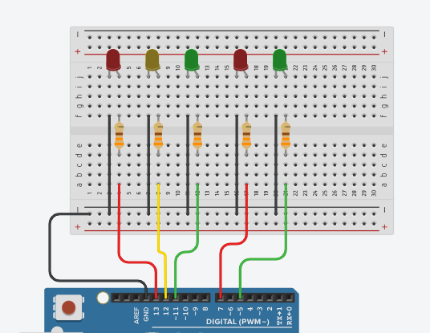

# Solucion Semaforo peatonal (Actividad)

Un grupo de peatones está esperando para cruzar la calle. Hay dos semáforos, uno para los peatones y otro para los coches. El semáforo para los peatones tiene dos luces: una roja y una verde. El semáforo para los coches tiene tres luces: una roja, una amarilla y una verde.

El problema es el siguiente: ¿cómo se puede asegurar que los peatones puedan cruzar la calle de forma segura, sin que los coches choquen contra ellos?

## Restriccionnes

- El semáforo para los peatones debe estar en verde durante un tiempo suficiente para que todos los peatones puedan cruzar la calle.
- El semáforo para los coches debe estar en rojo durante el tiempo que los peatones están cruzando la calle.
- Antes de que el semáforo para los coches cambie a rojo debe estar en amarillo un cierto tiempo para avisar a los carros a disminuir su velocidad.

## Materiales

- 2 LEDS Rojos
- 2 LEDS Verdes
- 1 LED Amarrillo
- 5 resistencias superiores a 220 ohms
- Arduino UNO
- Cables de conexion

## Conexiones



## Codigo

```arduino
# define ledRojoS1 13
# define ledAmarrilloS1 12
# define ledVerdeS1 11

# define ledRojoS2 7
# define ledVerdeS2 5

void setup() {
  pinMode(ledRojoS1, OUTPUT);
  pinMode(ledAmarrilloS1, OUTPUT);
  pinMode(ledVerdeS1, OUTPUT);

  pinMode(ledRojoS2, OUTPUT);
  pinMode(ledVerdeS2, OUTPUT);
}

void loop() {
  //SEMAFORO 1
  digitalWrite(ledRojoS1, HIGH);
  digitalWrite(ledAmarrilloS1,LOW);
  digitalWrite(ledVerdeS1,LOW);

  //SEMAFORO 2
  digitalWrite(ledRojoS2, LOW);
  digitalWrite(ledVerdeS2,HIGH);

  delay(10000);

  //SEMAFORO 1
  digitalWrite(ledRojoS1, LOW);
  digitalWrite(ledAmarrilloS1,LOW);
  digitalWrite(ledVerdeS1,HIGH);

  //SEMAFORO 2
  digitalWrite(ledRojoS2, HIGH);
  digitalWrite(ledVerdeS2,LOW);

  delay(8000);
  //SEMFORO1
  digitalWrite(ledVerdeS1,LOW);
  digitalWrite(ledAmarrilloS1,HIGH);
  delay(2000);
}
```
